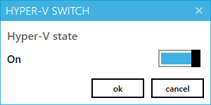
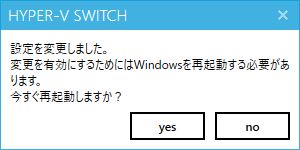

# HyperV-Switch

## 概要
本アプリケーションはHyper-Vの「ON / OFF」を変更するためのアプリケーションです。  
通常、Hyper-Vの設定を変更するためには以下の何れかの対応が必要となります。  

* コマンドプロンプトでbcdeditコマンドを利用して状態を切り替える  
* Hyper-Vのインストール・アンインストール

本アプリケーションではHype-Vの「ON / OFF」の切り替えをGUIで行う機能を提供します。  
Hyper-Vを切り替える煩雑さから解放されます。  

ただし、Windowsの再起動は必要です。  

## 前提条件

* Hyper-Vがインストール済みであること  
* .NET Framework 4.5.2がインストール済みであること  

## Download  

以下のリンク先から最新バージョンをダウンロードして利用してください。    

[https://github.com/nuitsjp/HyperV-Switch/releases](https://github.com/nuitsjp/HyperV-Switch/releases)

提供形式は以下の2種類を用意しています。    

* mis形式のインストーラ  
* インストール不要なZIPに格納した実行ファイル  

## 利用方法  

まずアプリケーションを起動してください。  
アプリケーションの起動には管理者権限が必要です。  

アプリケーションはHype-Vの状態を取得したのちに、以下の画面を表示します。  

トグルボタンがHype-Vの現在の状態を表しています。  
状態の変更が必要であれば、トグルを変更し「ok」ボタンをクリックしてください。  

状態の変更に成功したら、以下の画面が表示されます。  

「yes」ボタンをクリックすると、アプリケーションを終了しWindowsを再起動します。  

「no」をクリックした場合、アプリケーションを終了しますが、Windowsの再起動は実施しません。  
変更された設定を有効にするためには、Windowsの再起動が必要です。  
Windowsを再起動する準備ができた後、手動で実施してください。  
