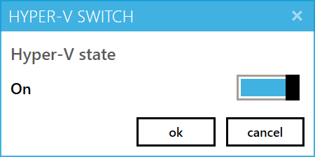
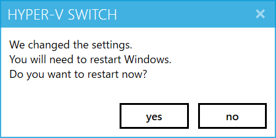

# HyperV-Switch

[日本語ドキュメントはこちら](README-jp.md)

## Description
It is an application to switch the ON / OFF of Hyper-V.  
If you want to use the Hyper-V at the same time not be able to run applications, usually there was a need to do one of the following.  

* Manual control by the bcdedit command on the console  
* Install or uninstall of the Hyper-V feature  

This application provides a GUI to operate the ON / OFF of Hyper-V.  
We are freed from cumbersome to switch the Hyper-V.  

However! , Restart of Windows is required.

## Precondition

* Hyper-V is installed.  
* .NET Framework 4.5.2 is installed  

## Download  

Please get the latest version is downloaded from the following.  

[https://github.com/nuitsjp/HyperV-Switch/releases](https://github.com/nuitsjp/HyperV-Switch/releases)

Distribution format There are two types.  

* mis Installer  
* Format without installation by ZIP file  

## How to Use  

Please start the application.  
It is to run the application you must be an Administrator.  

Application after obtaining the status of the Hyper-V, will display the following screen.

State of the toggle button represents the state of the Hyper-V.  
Change the toggle button, and then click the OK button.  

If successful on the state of the update you will see the following screen.  

When you click the "yes", will still be Windows restarts.  

If "no" is clicked, it will not be restarted to exit the application.  
The setting takes effect after you restart Windows.  
When you are ready, please, and then restart it manually.  